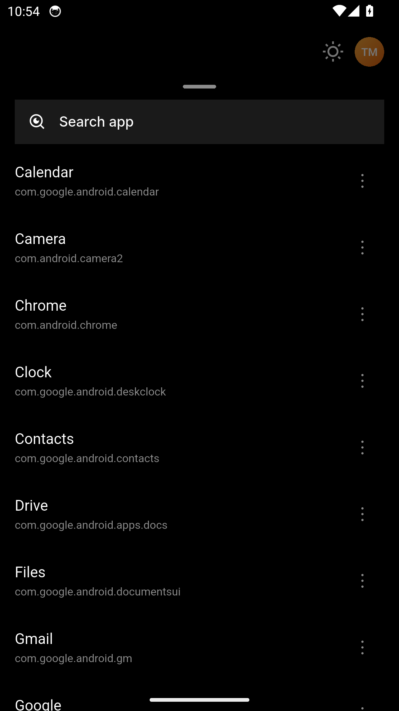
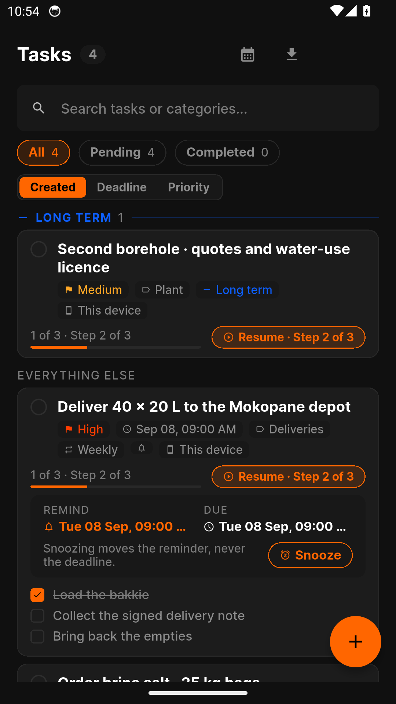
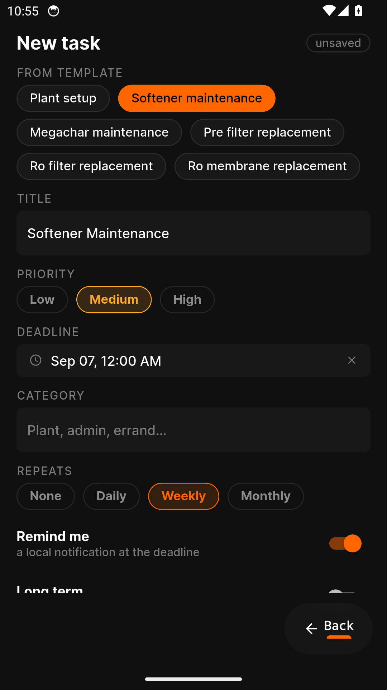
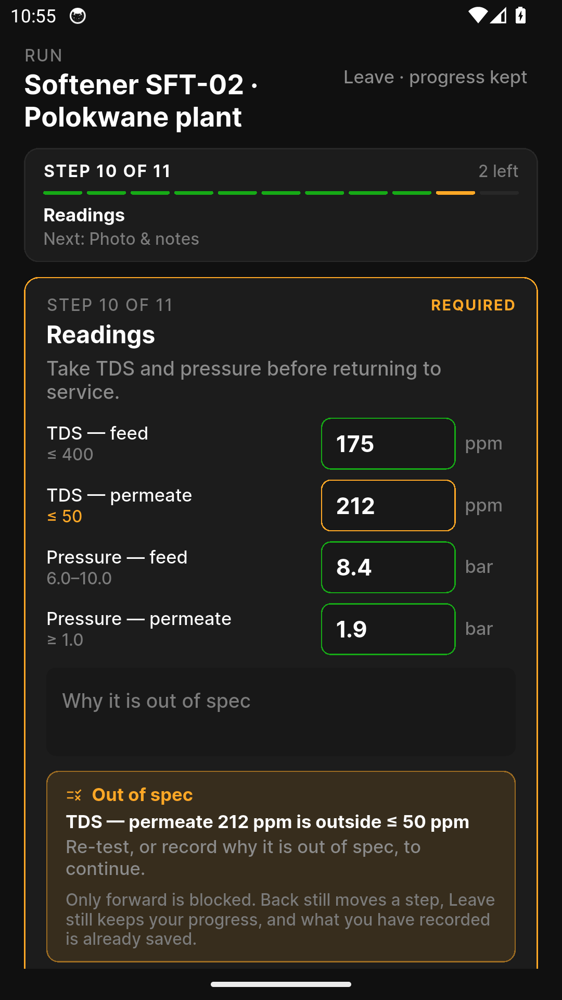
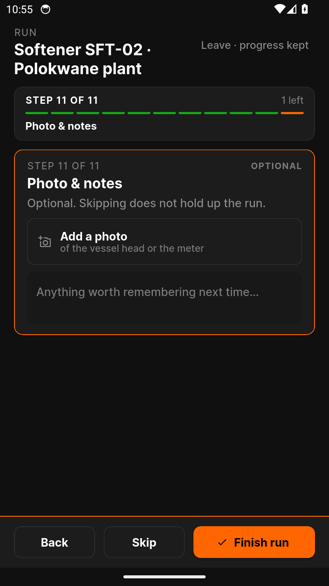

# Minilauncher — Feature Guide

A minimal launcher that keeps your phone simple

> This guide is generated automatically on every merge: CI builds the
> app, walks the guided tour on an Android emulator, and captures
> each screen below.

## 1. Welcome to Minilauncher

Minilauncher is your phone, simplified - sign in to get started.

## 2. Sign in

Signing in to Minilauncher is quick and simple.

## 3. Create an account

New to Minilauncher? Create your account in a few easy steps.

## 4. Reset your password

Forgot your password? Minilauncher gets you back in with a secure reset.

## 5. Your apps, one clean screen

Everything you need and nothing you don't - your apps on one calm screen.

## 6. Every app, one swipe up

Home stays short. Every installed app lives in the drawer, one swipe up, with
search.

## 7. Your account at a glance

Your name, role and details - your account in one clean card.

## 8. Plan your day in seconds

Capture to-dos with subtasks and categories - your day, planned before it
starts.

## 9. A service run from a template

Softener, megaChar, filters and membranes - one tap fills the task with every
step and its timing.

## 10. Readings before it goes back to service

TDS and pressure against the plant's limits - out of spec is named and holds the
finish until re-tested or explained.

## 11. A photo and a note, if you want them

The last step is optional - Skip is live beside Finish, and nothing here can
trap you mid-run.
