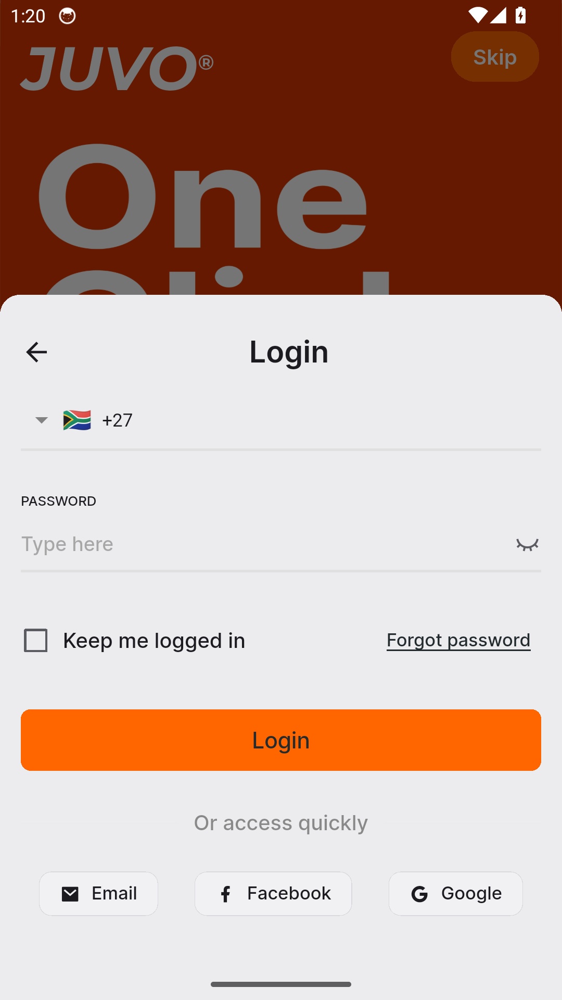
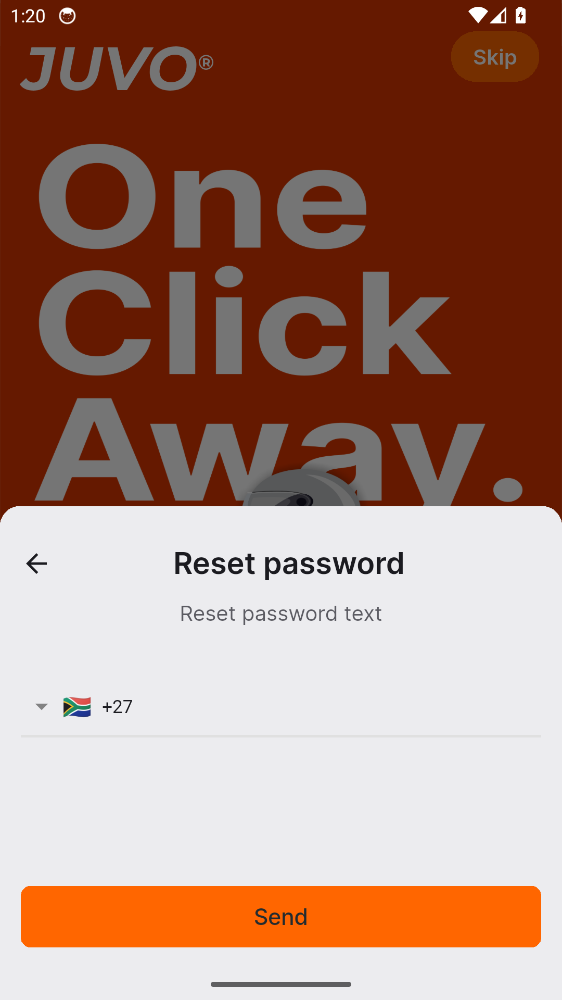
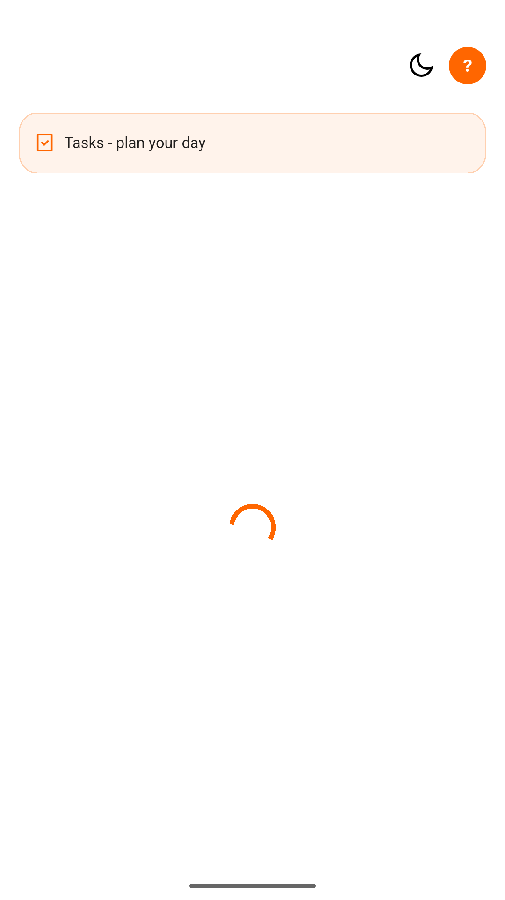
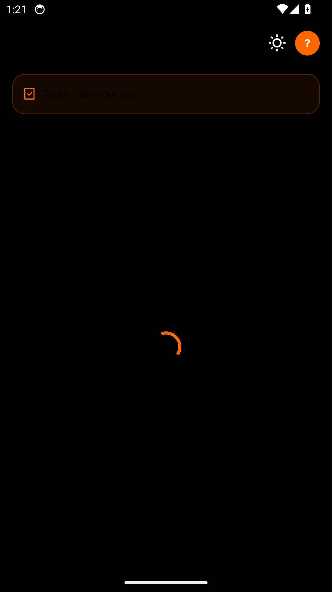
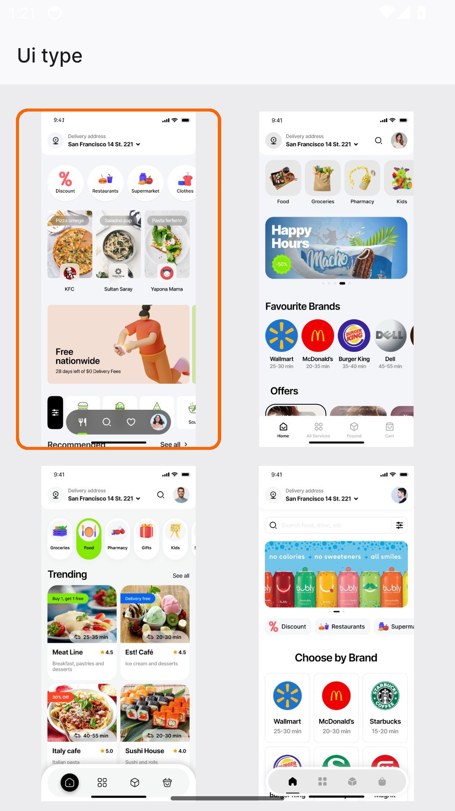
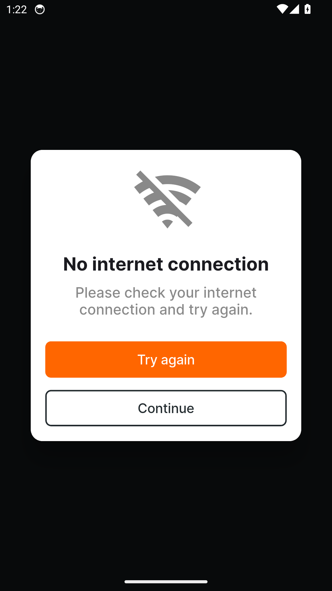
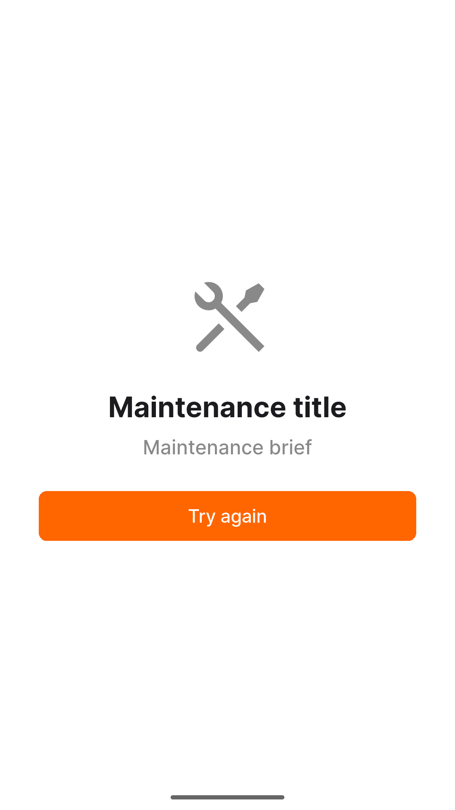
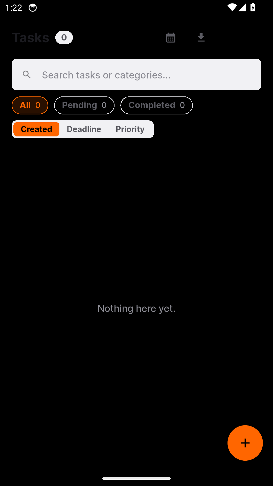

# Minilauncher — Feature Guide

A minimal launcher that keeps your phone simple

> This guide is generated automatically on every merge: CI builds the
> app, walks the guided tour on an Android emulator, and captures
> each screen below.

## 1. Welcome to Minilauncher

Minilauncher is your phone, simplified - sign in to get started.

## 2. Sign in

Signing in to Minilauncher is quick and simple.

## 3. Create an account

New to Minilauncher? Create your account in a few easy steps.

## 4. Reset your password

Forgot your password? Minilauncher gets you back in with a secure reset.

## 5. Your apps, one clean screen

Everything you need and nothing you don't - your apps on one calm screen.

## 6. Light or dark, one tap

Flip the whole launcher between light and dark with a single tap.

## 7. Your account at a glance

Your name, role and details - your account in one clean card.

## 8. Pick the look you like

Four home styles, one tap each - make Minilauncher look the way you want.

## 9. Honest about connection

Signal drops happen - Minilauncher says so clearly and gets you back with one
tap.

## 10. Honest about downtime

When we're improving things behind the scenes, you get a clear, friendly heads-
up - never a blank screen.

## 11. Plan your day in seconds

Capture to-dos with subtasks and categories - your day, planned before it
starts.
